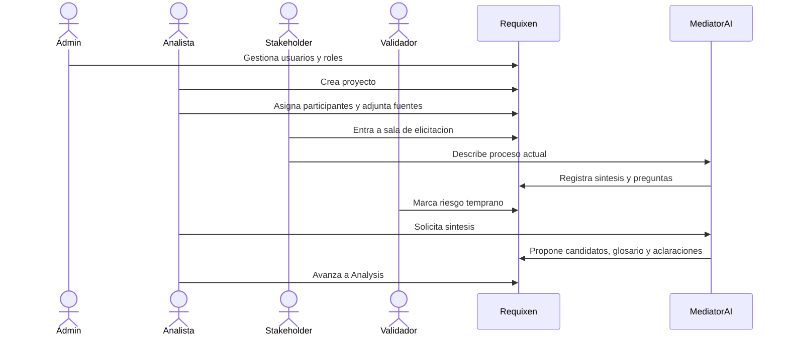

# Caso de uso ejemplo: gestion municipal de reclamos ciudadanos

Este caso de uso muestra como podria recorrerse Requixen en un proyecto real de gobierno digital. Sirve como ejemplo narrativo para entender pantallas, roles, artefactos y decisiones.

## 1. Contexto

Un municipio quiere modernizar la gestion de reclamos ciudadanos sobre infraestructura urbana: baches, luminarias rotas, limpieza, arbolado y problemas en la via publica.

Actualmente:

- Los reclamos llegan por telefono, formularios en papel, WhatsApp o presencialmente.
- No existe un criterio unico para registrar el reclamo.
- Los ciudadanos llaman varias veces para conocer el estado.
- Las areas municipales no siempre reciben la informacion completa.
- Hay demoras y poca trazabilidad.

El municipio quiere construir un sistema digital para registrar, derivar, seguir y responder reclamos ciudadanos.

## 2. Actores

### Admin

Configura usuarios, asigna personas al proyecto y supervisa que el equipo este completo.

### Analista RE

Conduce el proceso de Early Requirements Engineering. Crea el proyecto, revisa aportes, aprueba artefactos y decide cuando avanzar de fase.

### Stakeholder

Representa usuarios o areas del municipio. Puede ser personal de mesa de entrada, obras publicas, atencion ciudadana o un referente de gobierno digital.

### Validador

Revisa consistencia, riesgos, trazabilidad y evidencia. Puede ser un responsable metodologico, auditor interno o experto en calidad.

### Mediator AI

En la fase de elicitacion, ayuda a traducir lenguaje informal, hacer preguntas aclaratorias y sintetizar necesidades.

## 3. Objetivo del caso de uso

Crear un proyecto en Requixen, realizar la fase de elicitacion con varios usuarios y obtener candidatos iniciales de requisitos con contexto, fuentes y riesgos preliminares.

## 4. Precondiciones

- PocketBase esta configurado.
- Existen usuarios con roles:
  - `Admin`
  - `Analista RE`
  - `Stakeholder`
  - `Validador`
- OpenAI esta configurado para que el Mediator pueda responder.
- La coleccion de proyectos existe.
- La coleccion de archivos existe para adjuntos.
- La coleccion de mensajes de elicitacion existe o, si no existe, la sala funciona temporalmente en memoria local.

## 5. Flujo principal

### Paso 1: Login del admin

El admin ingresa a Requixen.

Pantalla:

- Titulo `Requixen`.
- Email.
- Password.
- Boton `Ingresar`.

Resultado:

- El sistema autentica al admin.
- Carga sus roles.
- Muestra la pantalla de proyectos.

### Paso 2: Admin revisa proyectos

El admin ve la pantalla `Proyectos`.

La pantalla muestra:

- Boton `Crear proyecto`.
- Boton `Gestionar usuarios`.
- Tarjetas compactas de proyectos.

Cada tarjeta muestra:

- Estado.
- Fecha.
- Nombre.
- Resumen breve.
- Organismo.
- Cantidad de adjuntos.

El admin no ve usuarios asignados dentro de la tarjeta. Si hace click en cualquier parte de la tarjeta, abre el proyecto.

### Paso 3: Admin gestiona usuarios

El admin entra en `Gestionar usuarios`.

Acciones:

- Revisa que existan los usuarios.
- Asigna roles multiples si hace falta.
- Por ejemplo, el usuario `Carlos` puede tener:

```json
["admin", "analyst"]
```

Resultado:

- Los usuarios quedan listos para ser asignados a proyectos.

### Paso 4: Analista crea el proyecto

El analista o admin presiona `Crear proyecto`.

La creacion ocurre como flujo paso a paso:

1. Nombre del proyecto:

```txt
Sistema municipal de reclamos ciudadanos
```

2. Organismo o area:

```txt
Municipalidad de San Fernando del Valle de Catamarca - Atencion Ciudadana
```

3. Problema inicial:

```txt
Los reclamos ciudadanos se reciben por canales dispersos y no existe trazabilidad clara del estado de cada reclamo.
```

4. Stakeholders:

```txt
Mesa de entrada, Atencion Ciudadana, Obras Publicas, ciudadanos, Gobierno Digital
```

5. Usuarios asignados:

- Analista RE.
- Stakeholder de Atencion Ciudadana.
- Stakeholder de Obras Publicas.
- Validador.

6. Documentos iniciales:

- Planilla de reclamos historicos.
- Capturas de formularios actuales.
- Procedimiento interno de derivacion.

Resultado:

- Se crea el proyecto en PocketBase.
- Se guardan los adjuntos en storage.
- Se abre el mapa del proyecto.

## 6. Mapa del proyecto

El sistema muestra el `Mapa operativo del modelo`.

Se ven las cuatro fases:

1. Elicitation / Mediator.
2. Analysis / Co-creator.
3. Negotiation / Facilitator.
4. Validation / Assistant.

Tambien se ve la capa transversal:

- Artefactos.
- Flags de riesgo.
- Trazabilidad.
- Auditoria.

En esta etapa solo esta habilitada la fase 1: `Elicitation / Mediator`.

El analista entra a la fase de elicitacion.

## 7. Fase 1: Elicitacion con stakeholders

### 7.1 Stakeholder de Atencion Ciudadana entra a la sala

El stakeholder abre el proyecto y entra a la sala de elicitacion.

La pantalla no parece un dashboard. Solo muestra la sala:

- Historial de chats.
- Conversacion activa.
- Campo para escribir.
- Boton de adjuntar archivos.
- Boton de voz.
- Boton `Ponerme en contexto`.

El stakeholder escribe:

```txt
Cuando un vecino llama por un bache, anotamos el reclamo en una planilla. A veces falta la direccion exacta o una foto. Despues se deriva a Obras Publicas, pero no siempre sabemos si alguien lo recibio.
```

El Mediator responde:

```txt
Entiendo. Registro que el proceso actual depende de una planilla, que la direccion y evidencia pueden estar incompletas, y que hay incertidumbre sobre la recepcion por Obras Publicas. Para aclarar: que datos minimos deberia tener un reclamo para poder derivarse?
```

### 7.2 Stakeholder de Obras Publicas participa en paralelo

Otro stakeholder entra a la misma sala del proyecto.

Presiona `Ponerme en contexto`.

El sistema le muestra:

- Resumen del proyecto.
- Aportes recientes de otros usuarios.
- Fuentes disponibles.
- Preguntas abiertas.

Luego escribe:

```txt
Para intervenir necesitamos ubicacion precisa, tipo de problema, prioridad y si hay riesgo para peatones o vehiculos. Muchas veces recibimos reclamos duplicados.
```

El Mediator responde:

```txt
Registro datos minimos para derivacion: ubicacion, tipo de problema, prioridad y riesgo. Tambien aparece una posible necesidad: detectar reclamos duplicados antes de crear una nueva orden.
```

### 7.3 El validador observa riesgos tempranos

El validador entra a la sala.

No necesita conducir la conversacion. Observa:

- Aportes.
- Fuentes.
- Riesgos de inferencia.
- Preguntas abiertas.

Marca una preocupacion:

```txt
La prioridad del reclamo no deberia calcularse solo por texto libre. Deberia existir un criterio acordado por el municipio.
```

El Mediator registra esto como riesgo temprano:

```txt
Riesgo: la prioridad podria ser inferida sin una regla institucional explicita. Se recomienda definir criterios de prioridad con actores municipales.
```

### 7.4 El analista sintetiza

El analista entra a la sala y revisa los aportes.

Acciones:

- Lee los mensajes de stakeholders.
- Revisa preguntas abiertas.
- Pide al Mediator una sintesis.

El Mediator propone:

```txt
Sintesis preliminar:
1. El sistema debe registrar reclamos con datos minimos: ubicacion, tipo de problema, evidencia y datos de contacto.
2. El sistema debe derivar reclamos al area responsable.
3. El sistema debe permitir consultar el estado del reclamo.
4. El sistema deberia detectar posibles reclamos duplicados.
5. La prioridad requiere criterios institucionales explicitos.
```

## 8. Artefactos esperados de la fase 1

Al cerrar la elicitacion inicial, Requixen deberia producir:

### Raw requirement candidates

```txt
RC-01: Registrar reclamos ciudadanos con informacion minima obligatoria.
RC-02: Adjuntar evidencia como fotos o documentos.
RC-03: Derivar reclamos al area municipal correspondiente.
RC-04: Consultar estado del reclamo.
RC-05: Detectar posibles reclamos duplicados.
RC-06: Clasificar prioridad segun criterios institucionales.
```

### Glossary

```txt
Reclamo: comunicacion ciudadana sobre un problema urbano.
Derivacion: envio del reclamo al area responsable.
Orden de trabajo: tarea operativa creada para resolver un reclamo.
Prioridad: nivel de urgencia definido por reglas municipales.
Duplicado: reclamo que refiere al mismo problema ya registrado.
```

### Clarification log

```txt
CL-01: Definir datos minimos obligatorios para crear reclamo.
CL-02: Acordar criterios de prioridad.
CL-03: Determinar como se identifica un duplicado.
CL-04: Confirmar que estados del reclamo seran visibles para ciudadanos.
```

### Risk flags

```txt
RF-01: Posible inferencia: deteccion de duplicados fue mencionada como problema, pero aun no fue aprobada como requisito.
RF-02: Riesgo de regla institucional ausente: prioridad no debe ser inferida sin criterio formal.
RF-03: Riesgo de trazabilidad: consultar estado fue mencionado indirectamente por la incertidumbre del proceso, requiere confirmacion stakeholder.
```

## 9. Transicion a Analysis / Co-creator

Cuando el analista considera suficiente la elicitacion inicial, avanza a Analysis.

Entrada:

- Raw candidates.
- Glossary.
- Clarification log.
- Fuentes.
- Risk flags.

La IA cambia de rol:

```txt
De Mediator a Co-creator.
```

Ahora la IA ya no solo media conversaciones. Ayuda a construir artefactos formales.

## 10. Fase 2: Analysis / Co-creator

El analista ve una mesa de revision.

La IA propone user stories:

```txt
US-01:
Como ciudadano,
quiero registrar un reclamo con ubicacion, tipo de problema y evidencia,
para que el municipio pueda evaluarlo y derivarlo al area responsable.

Criterios de aceptacion:
- El sistema debe solicitar ubicacion.
- El sistema debe solicitar tipo de problema.
- El sistema debe permitir adjuntar evidencia.
- El sistema debe generar un numero de reclamo.
```

El analista puede:

- Aprobar.
- Editar.
- Pedir revision.
- Descartar.

Cada user story muestra:

- Fuente.
- Confianza.
- Riesgos.
- Trazabilidad con aportes de la sala.

## 11. Fase 3: Negotiation / Facilitator

Supongamos que aparece un conflicto:

- Atencion Ciudadana quiere que todo reclamo se registre inmediatamente.
- Obras Publicas quiere bloquear reclamos sin datos minimos.

La IA como Facilitator presenta opciones:

```txt
Opcion A: permitir registro incompleto y marcarlo como pendiente de informacion.
Opcion B: impedir registro hasta completar datos minimos.
Opcion C: registrar reclamo preliminar, pero no derivarlo hasta completar datos minimos.
```

Los humanos deciden.

Decision:

```txt
Se adopta opcion C: reclamo preliminar sin derivacion hasta completar datos minimos.
```

La IA documenta el acuerdo, pero no decide.

## 12. Fase 4: Validation / Assistant

El validador solicita checks:

- Consistencia entre requisitos.
- Trazabilidad completa.
- Ambiguedades residuales.
- Cobertura de criterios de aceptacion.

La IA como Assistant ejecuta:

```txt
Check de trazabilidad:
US-01 esta trazada a aportes de Atencion Ciudadana y Obras Publicas.
US-04 consulta de estado requiere confirmacion adicional de ciudadanos o atencion ciudadana.
```

Reporte:

```txt
Validation report:
- 5 requisitos validados.
- 1 requisito con trazabilidad debil.
- 2 aclaraciones pendientes.
- 0 conflictos abiertos.
```

## 13. Resultado final del caso

Al finalizar el recorrido, Requixen deberia haber generado:

- Proyecto creado y equipo asignado.
- Sala de elicitacion con historial.
- Documentos adjuntos.
- Raw requirement candidates.
- Glossary.
- Clarification log.
- User stories.
- Acceptance criteria.
- Conflict matrix.
- Agreed requirements.
- Validation report.
- Traceability matrix.
- Risk flags.
- Audit trail.

## 14. Valor del caso

Este caso muestra la idea central de Requixen:

```txt
La IA no es un asistente generico.
La IA cambia de rol segun la fase.
El control humano aumenta a medida que el proceso se acerca a decisiones comprometidas.
Los riesgos se monitorean de forma transversal durante todo el ciclo.
```

## 15. Pantallas involucradas



## 16. Criterio de exito

El caso funciona si un usuario puede entender claramente:

- Que proyecto se esta trabajando.
- Quienes participan.
- Que fase del modelo esta activa.
- Que rol cumple la IA.
- Que aportes humanos originaron cada artefacto.
- Que riesgos siguen abiertos.
- Que decisiones humanas quedaron registradas.
