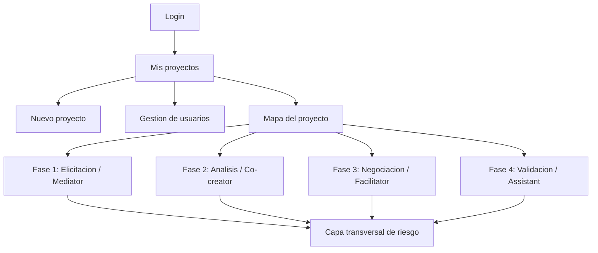

# Vision de flujos y pantallas de Requixen

Este documento describe como imagino la evolucion funcional y visual de Requixen como herramienta web para Early Requirements Engineering mediado por GenAI en gobierno digital.

La idea central es que Requixen no se sienta como un asistente generico, sino como una herramienta por capas donde cada fase del modelo tiene una experiencia propia, un rol GenAI diferenciado y mecanismos visibles de control humano, trazabilidad y riesgo.

## 1. Principios de experiencia

### Herramienta, no landing page

La aplicacion debe abrir directamente en un flujo operativo. El usuario entra para gestionar proyectos, participar en elicitacion, revisar artefactos o validar requisitos. No necesita una portada comercial.

### El proyecto como unidad central

Todo debe estar organizado alrededor de proyectos. Cada proyecto tiene:

- Equipo asignado.
- Sala de elicitacion propia.
- Historial de conversaciones.
- Documentos iniciales.
- Artefactos por fase.
- Riesgos, trazabilidad y auditoria.

### Roles humanos con pantallas distintas

El sistema no deberia mostrar la misma experiencia a todos. Un stakeholder no necesita ver lo mismo que un analista, y un admin no necesita la complejidad del flujo RE mientras gestiona usuarios.

Roles principales:

- `Admin`: gestiona usuarios, proyectos y accesos.
- `Analista RE`: conduce el proceso, revisa y aprueba artefactos.
- `Stakeholder`: aporta conocimiento de dominio en lenguaje natural.
- `Validador`: revisa consistencia, trazabilidad, riesgos y problemas residuales.

### GenAI con rol por fase

Cada fase debe hacer visible que la IA cambia de comportamiento:

- `Mediator`: ayuda a entender y traducir lenguaje informal.
- `Co-creator`: ayuda a construir artefactos formales.
- `Facilitator`: ayuda a comparar opciones y conflictos sin decidir.
- `Assistant`: ejecuta verificaciones bajo control humano.

### Riesgo transversal visible

La capa de riesgo no debe ser una seccion secundaria. Debe aparecer como informacion persistente en cada artefacto:

- Confianza.
- Fuente.
- Riesgos de inferencia.
- Posible alucinacion.
- Ambiguedad.
- Perdida de contexto.
- Trazabilidad fabricada o debil.

## 2. Mapa general de pantallas



## 3. Login

### Objetivo

Permitir ingreso rapido y sin distracciones.

### Pantalla ideal

Una pantalla minima con:

- Titulo `Requixen`.
- Campo email.
- Campo password.
- Boton `Ingresar`.

### Comportamiento

Al iniciar sesion:

- Se obtiene el usuario desde PocketBase.
- Se cargan sus roles.
- Si tiene varios roles, luego podra cambiar rol activo desde la barra superior.
- Se cargan proyectos visibles segun asignacion.

## 4. Pantalla de proyectos

### Objetivo

Mostrar los proyectos disponibles y permitir acceder rapidamente a uno.

### Para admin

Debe ser simple y operativa:

- Header superior con usuario, rol activo, idioma y salir.
- Titulo `Proyectos`.
- Acciones principales:
  - `Crear proyecto`.
  - `Gestionar usuarios`.
- Tarjetas compactas de proyectos.

### Tarjeta de proyecto

La tarjeta deberia mostrar solo:

- Estado actual.
- Fecha de ultima actividad.
- Nombre del proyecto.
- Resumen breve.
- Organismo/area.
- Cantidad de adjuntos.

No deberia mostrar:

- Usuarios asignados.
- Grillas de usuarios.
- Boton `Abrir proyecto`.

La tarjeta completa debe ser clickeable y abrir el proyecto.

### Para analista

Similar a admin, pero con foco en:

- Proyectos asignados.
- Crear proyecto.
- Continuar fase pendiente.
- Revisar artefactos pendientes.

### Para stakeholder

Mas simple todavia:

- Proyectos donde participa.
- Indicador de actividad reciente en la sala.
- Acceso directo a la sala de elicitacion.

### Para validador

Orientado a:

- Proyectos asignados.
- Requisitos pendientes de validacion.
- Riesgos abiertos.
- Trazabilidad incompleta.

## 5. Nuevo proyecto

### Objetivo

Permitir que el analista o admin cree un proyecto con contexto inicial suficiente.

### Experiencia ideal

Un flujo tipo Typeform, paso a paso:

1. Nombre del proyecto.
2. Organismo o area responsable.
3. Problema inicial.
4. Stakeholders involucrados.
5. Usuarios asignados.
6. Documentos iniciales.
7. Revision final.

### Mediator durante creacion

La IA debe actuar como `Mediator` liviano:

- Preguntar por contexto faltante.
- Sugerir actores que podrian participar.
- Detectar si el problema esta demasiado ambiguo.
- No generar requisitos finales todavia.

### Resultado

Al finalizar, el sistema crea:

- Proyecto en PocketBase.
- Participantes.
- Documentos en storage.
- Sala de elicitacion inicial.
- Primer resumen de contexto.

## 6. Gestion de usuarios

### Objetivo

Permitir que admin gestione cuentas y roles.

### Pantalla ideal

Una tabla o lista compacta con:

- Nombre.
- Email.
- Roles.
- Estado.
- Acciones.

### Comportamiento

Admin puede:

- Crear usuario.
- Editar nombre/email.
- Asignar multiples roles.
- Asignar area municipal.
- Desactivar o eliminar usuario.

### Roles multiples

Un usuario puede tener varios roles, por ejemplo:

```json
["admin", "analyst"]
```

En la app, el usuario puede cambiar su rol activo desde la barra superior.

## 6.1 Gestion de areas municipales

### Objetivo

Representar el organigrama del municipio y usarlo como contexto para usuarios, proyectos y elicitacion.

### Pantalla ideal

Una pantalla admin con:

- Crear area.
- Codigo opcional.
- Descripcion.
- Area padre opcional.
- Vista jerarquica tipo organigrama.

### Modelo

Cada area tiene:

- `name`
- `code`
- `description`
- `parentAreaId`

Esto permite modelar, por ejemplo:

```txt
Secretaria de Gobierno
  Atencion Ciudadana
  Mesa de Entrada
Secretaria de Obras Publicas
  Alumbrado
  Pavimento
```

Cada usuario pertenece a un area municipal. En fases futuras, esta pertenencia puede usarse para:

- Filtrar stakeholders por area.
- Detectar areas faltantes en la elicitacion.
- Interpretar conflictos entre areas.
- Mejorar trazabilidad organizacional.

## 7. Mapa del proyecto

### Objetivo

Mostrar el estado del proyecto segun el modelo de cuatro capas.

### Pantalla ideal

La pantalla debe mostrar:

- Nombre y resumen del proyecto.
- Principios del modelo:
  - Rol GenAI diferenciado.
  - Gradiente de control humano.
  - Riesgo transversal.
- Las cuatro fases:
  - Elicitation / Mediator.
  - Analysis / Co-creator.
  - Negotiation / Facilitator.
  - Validation / Assistant.
- Capa transversal de confiabilidad:
  - Artefactos.
  - Flags de riesgo.
  - Trazabilidad.
  - Auditoria.

### Comportamiento

Cada fase debe mostrar:

- Entrada esperada.
- Salida esperada.
- Rol de IA.
- Nivel de control humano.
- Estado: disponible, pendiente, bloqueada o completada.

## 8. Fase 1: Elicitacion / Mediator

### Objetivo

Capturar necesidades, contexto, vocabulario, problemas y excepciones desde multiples usuarios.

### Experiencia por rol

#### Stakeholder

Debe ver solo la sala de elicitacion, sin dashboard.

La pantalla debe parecerse a una experiencia conversacional:

- Historial de chats del proyecto.
- Chat activo.
- Adjuntar archivos.
- Entrada por voz.
- Boton para ponerse en contexto.
- Respuestas del Mediator.

El stakeholder no deberia tener que escribir requisitos tecnicos. Debe poder contar:

- Que hace hoy.
- Que problemas tiene.
- Que excepciones existen.
- Que terminos locales usan.
- Que informacion falta.

#### Analista

Tambien entra a la sala, pero con capacidades adicionales:

- Ver aportes de todos.
- Pedir sintesis al Mediator.
- Marcar preguntas pendientes.
- Convertir aportes en candidatos.
- Preparar salida hacia Analysis.

#### Admin

Deberia poder:

- Ver actividad general.
- Confirmar participacion de actores.
- Ver si faltan roles clave.
- No interferir en la conversacion salvo que sea necesario.

#### Validador

Durante elicitacion puede:

- Observar fuentes.
- Marcar riesgos tempranos.
- Indicar informacion no verificable.
- Sugerir necesidad de evidencia.

### Artefactos de salida

La fase produce:

- Raw requirement candidates.
- Glossary.
- Clarification log.
- Session summaries.
- Source references.

## 9. Fase 2: Analisis / Co-creator

### Objetivo

Transformar insumos informales en artefactos estructurados.

### Pantalla ideal

Una mesa de revision para analista:

- Columna izquierda: candidatos crudos y fuentes.
- Centro: artefactos propuestos.
- Derecha: riesgos y trazabilidad.

### IA como Co-creator

La IA puede proponer:

- User stories.
- Acceptance criteria.
- Ambiguity flags.
- Gap report.
- Posibles modelos de dominio.

### Control humano

El analista debe aprobar artefacto por artefacto.

Estados posibles:

- Propuesto.
- Aprobado.
- Requiere revision.
- Descartado.

### Riesgo

Cada artefacto debe mostrar:

- Confianza.
- Fuente usada.
- Fragmento o aporte relacionado.
- Riesgos de inferencia.

## 10. Fase 3: Negociacion / Facilitator

### Objetivo

Ayudar a resolver conflictos entre necesidades, prioridades y restricciones.

### Pantalla ideal

Una vista de decision colaborativa:

- Matriz de conflictos.
- Requisitos afectados.
- Actores involucrados.
- Opciones de resolucion.
- Trade-offs.
- Decision humana registrada.

### IA como Facilitator

La IA no decide. Solo:

- Identifica conflictos.
- Presenta opciones neutrales.
- Explica consecuencias.
- Sugiere compromisos.
- Documenta acuerdos.

### Salidas

- Conflict matrix.
- Trade-off options.
- Compromise proposals.
- Agreed requirements.
- Decision log.

## 11. Fase 4: Validacion / Assistant

### Objetivo

Verificar que los requisitos acordados sean consistentes, trazables y reflejen intenciones reales.

### Pantalla ideal

Una consola de validacion:

- Checklist de validacion.
- Matriz de trazabilidad.
- Issues residuales.
- Reporte generado.
- Acciones explicitas solicitadas por el analista o validador.

### IA como Assistant

La IA opera bajo control total humano:

- Ejecuta checks solicitados.
- No inventa nuevos requisitos.
- No cambia decisiones.
- Reporta problemas.

### Salidas

- Validation report.
- Traceability matrix.
- Issue list.
- Confidence summary.

## 12. Capa transversal de riesgo

### Objetivo

Monitorear la confiabilidad de todo lo generado o mediado por IA.

### Debe estar presente en todas las fases

No como una pantalla aislada, sino como panel o metadata persistente.

### Riesgos a mostrar

- Hallucinated requirements.
- Domain bias.
- Context loss.
- Traceability fabrication.
- Ambiguity.
- Missing source.

### Para cada artefacto

Mostrar:

- Score de confianza.
- Fuentes.
- Links de trazabilidad.
- Flags de riesgo.
- Historial de acciones.

## 13. Auditoria

### Objetivo

Registrar decisiones humanas y acciones relevantes de IA.

### Eventos

- Proyecto creado.
- Documento adjuntado.
- Mensaje enviado.
- Sintesis generada.
- Artefacto propuesto.
- Artefacto aprobado.
- Riesgo marcado.
- Decision de negociacion.
- Validacion ejecutada.

## 14. Navegacion propuesta

### Barra superior

Debe mantenerse simple:

- Requixen.
- Usuario.
- Rol activo.
- Idioma.
- Salir.

### Navegacion interna

La navegacion depende del contexto:

- En lista: proyectos.
- En proyecto: mapa de fases.
- En fase: volver al mapa del proyecto.
- En admin: volver a proyectos.

Evitar sidebars globales pesadas por ahora.

## 15. Evolucion sugerida

### Proximo corte recomendado

Profundizar la fase 1:

- Persistir sesiones de chat desde PocketBase.
- Cargar historiales reales al abrir proyecto.
- Separar chats por proyecto.
- Guardar adjuntos por sesion.
- Mostrar actividad paralela real.

### Segundo corte

Implementar fase 2:

- Transformar aportes de elicitacion en candidatos.
- Generar user stories y acceptance criteria con OpenAI.
- Guardar artefactos en PocketBase.
- Agregar aprobacion por analista.

### Tercer corte

Implementar capa de riesgo real:

- Risk flags persistidos.
- Confidence score por artefacto.
- Trazabilidad fuente -> aporte -> artefacto.
- Auditoria persistida.

### Cuarto corte

Implementar negotiation y validation:

- Matriz de conflictos.
- Opciones de trade-off.
- Acuerdos.
- Validacion asistida.
- Reporte final.

## 16. Criterio de diseno

Requixen debe sentirse como una herramienta especializada para trabajo serio, no como un chat generico ni como un dashboard administrativo.

La interfaz ideal combina:

- Conversacion cuando el usuario aporta contexto.
- Tablas/matrices cuando el usuario compara o decide.
- Cards compactas cuando el usuario escanea.
- Paneles de riesgo cuando el usuario valida confianza.
- Auditoria cuando el usuario necesita justificar decisiones.

El modelo del paper debe ser visible en la interfaz: cada pantalla deberia responder claramente a una pregunta:

```txt
En que fase estoy, que rol cumple la IA, que control humano aplica, que artefactos se producen y que riesgos estan abiertos?
```
